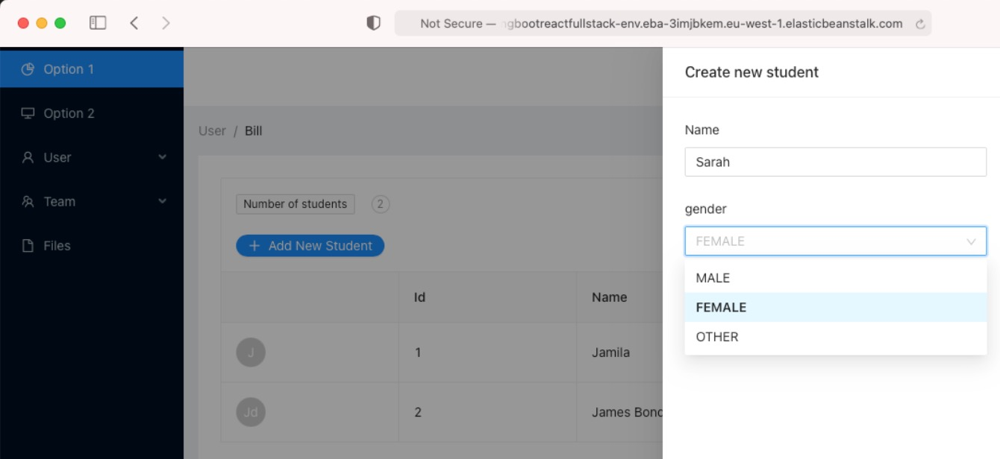
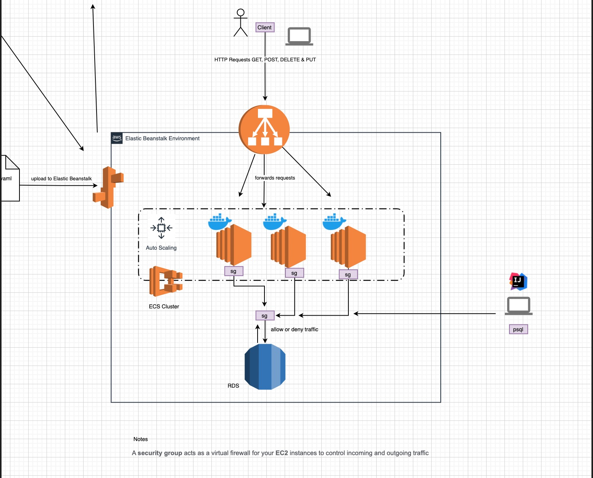

# Junit Tests

### [View all Roadmaps](https://github.com/nholuongut/all-roadmaps) &nbsp;&middot;&nbsp; [Best Practices](https://github.com/nholuongut/all-roadmaps/blob/main/public/best-practices/) &nbsp;&middot;&nbsp; [Questions](https://www.linkedin.com/in/nholuong/)
 

# Course Description
Spring Boot allows to take an idea/prototype and turn it into a real thing in matters minutes hours of months and years. A lot of companies use Spring Boot because it's easy to setup, learn and write code very fast without having to setup the low level platform code. Recently, Netflix has decided to switch their entire backend to Spring Boot. This shows that Spring Boot is a must if you are or want to become a software engineer in the Java world.
This course teaches how to build a full stack application from the ground up and touches on very import concepts used in real live software development. Concepts such as:

- Spring Boot Backend API
- Frontend with React.js Hooks and Functions Components
- Maven Build Tool
- Databases using Postgres on Docker
- Spring Data JPA
- Server and Client Side Error Handling
- Packaging applications for deployment using Docker and Jib
- AWS RDS & Elastic Beanstalk
- Software Deployment Automation with Github Actions
- Software Deployment Monitoring with Slack
- Unit and Integration Testing

This course focus on teaching you the process needed to build your own apps and deploy to real users using real software development techniques and skills. The skills gained at the end of this can be applied immediately on your own projects, university projects and at your work place.

# 🚀 I'm are always open to your feedback.  Please contact as bellow information:
### [Contact ]
* [Name: nho Luong]
* [Skype](luongutnho_skype)
* [Github](https://github.com/nholuongut/)
* [Linkedin](https://www.linkedin.com/in/nholuong/)
* [Email Address](luongutnho@hotmail.com)

# License
* Nho Luong (c). All Rights Reserved.🌟
